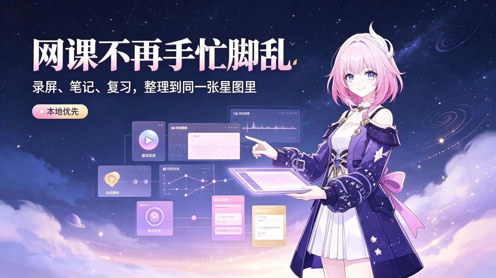

<!-- ============================================================
     NoteStar · 笔记星图  README (English)
     Anime / Omphalos aesthetic / Local-first
     ============================================================ -->

<p align="center">
  <a href="https://space.bilibili.com/12644772">
    
  </a>
</p>

<div align="center">

**🤍 星萌Y小郭酱 (Xingmeng Y Xiaoguo Jiang)**

Bilibili creator · Anime / Blender NPR / indie dev

📺 [Bilibili Space](https://space.bilibili.com/12644772) · 🌐 [English](README.en.md) / [中文](README.md)

</div>

---

<p align="center">


</p>

<div align="center">

# 🌌 NoteStar · 笔记星图

### Turn online courses into an Omphalos adventure ✨

**Auto screen-capture notes · AI tutor · Local-first · Anime aesthetic**

</div>

<div align="center">

[](#-license)
[](#-requirements)
[](#-requirements)
[](#-tech-stack)
[](#-tech-stack)
[](https://space.bilibili.com/12644772)

</div>

---

## 🎭 What is NoteStar

Scrambling to take notes during class? Forgetting everything right after? Reviewing with no map?

**Whatever you can't remember, NoteStar remembers for you.**

Click the floating bubble to start recording — AI quietly grabs a frame now and then, understands what you're learning, and organizes the key points into illustrated notes with timestamps. Review right after class, no more scrubbing from the start (｡•̀ᴗ-)✧

> All data lives on your own machine. In local mode, you don't even need internet.

---

## ✨ The Magic

<div align="center">

| | |
|:---:|:---:|
| **🎥 Follow-Capture Notes**<br>One-click recording, AI frame capture & recognition, real-time timeline notes | **🤖 Dual AI Modes**<br>Cloud DeepSeek / Volcengine, or local Ollama — switch anytime |
| **🕸️ Knowledge Web**<br>Knowledge points auto-link into a web, cross-course search | **🔁 Review Loop**<br>AI quizzes, immersive review, due reminders |
| **🎙️ Voice Loop**<br>Local transcription + TTS, review while walking | **📊 Study Dashboard**<br>Time · notes · progress · weekly reports |
| **🎨 Omphalos Aesthetic**<br>Pink-purple-gold · Bento cards · breathing inline SVG | **🔒 Your Data, Your Rules**<br>All local — nothing leaves your machine in local mode |

</div>

---

## 🎬 Video Intro

<div align="center">

[](https://www.bilibili.com/video/BV1eWY76xEG5)

**📺 Click the cover to watch on Bilibili · 20 min**

> Rediscover how to take notes during online classes, in the name of Omphalos.

</div>

---

## 🖼️ Showcase

<div align="center">

| Dashboard · Study stats | Notes · Timeline |
|:---:|:---:|
|  |  |
| Study stats · Pomodoro · Review list | Course-note org · Follow-capture |

| Knowledge Web · Graph | AI Tutor · Contextual Q&A |
|:---:|:---:|
|  |  |
| Auto knowledge linking | Explains & quizzes from your notes |

| Immersive Review | Blacktide Erosion · Skin |
|:---:|:---:|
|  |  |
| Review once, remember it | Ink erosion · gold-red flames · embers |

| Settings | |
|:---:|:---:|
|  |  |
| AI · voice · appearance · recording | Skins are the real deal 🎨 |

</div>

---

## 🚀 60-Second Start

```bash
cd app
npm install        # install dependencies
npm run build      # production build
npm start          # run!
```

> Windows shortcut: double-click `启动.bat` in the root folder.

**First run**: open **Settings**, set up AI (cloud API key / local Ollama), then hit the floating bubble to record — let it do the rest (๑•̀ㅂ•́)و✧

---

## 🧠 Local AI (optional)

Want data to stay completely on-device? Pull three models:

```bash
ollama pull moondream            # Vision: understand frames on your screen
ollama pull qwen2.5:7b-instruct  # Text: chat / summary / quizzes / weekly reports
ollama pull nomic-embed-text     # Embeddings: weave knowledge into the web
```

No model? No problem — follow-capture gracefully degrades to "screenshot saved". Recording never blocks, and you can run recognition later.

---

## 🛠️ Tech Stack

| Layer | Choice |
|---|---|
| Renderer | Vue 3 · TypeScript · Vite |
| Desktop shell | Electron (main process loads source directly) |
| Note rendering | Markdown · KaTeX math |
| Cloud AI | DeepSeek / Volcengine |
| Local AI | Ollama: moondream / qwen2.5 / nomic |
| STT / TTS | faster-whisper · Windows SAPI |
| Storage | Local JSON + image/video files |

---

## ⚙️ Requirements

- **Windows 10/11 64-bit** (floating bubble, recording & voice rely on Windows)
- **Node.js ≥ 18**
- **(Optional) Ollama** — without it, use cloud mode
- **(Optional) Python + ffmpeg** — audio transcription; bundled in portable build

---

## 🗺️ Roadmap

- 🎨 More theme skins (skins are the real deal!)
- 🍎 macOS / Linux support
- 📝 Note templates & share cards
- ☁️ Cloud sync (opt-in, off by default, preserving local-first)

---

## 💭 Why build this?

I built NoteStar because I believe: **AI is a tool to assist learning, not replace it.**

AI evolves fast and knows more every day. But **what AI knows doesn't mean you know it.**

So this app was never meant to "let AI learn the course for you." It automates the tedious, time-consuming parts — recording, organizing, reviewing — so you can spend the time you save on actually **understanding and thinking**.

Follow-capture keeps you from missing key points, the graph links knowledge together, quizzes test what you've mastered — but in the end, the one sitting in front of the screen, turning knowledge into your own, is you.

May this small toolkit carry you a little further ✨

---

## 👤 Author

<div align="center">

[](https://space.bilibili.com/12644772)

**星萌Y小郭酱 (Xingmeng Y Xiaoguo Jiang)**

Bilibili creator · Anime / Blender NPR / indie dev

📺 [Visit my Bilibili Space](https://space.bilibili.com/12644772)

Liked it? Drop a **Star ⭐** or come say hi on Bilibili~

</div>

---

## 📄 License

Released under the **[MIT License](LICENSE)**. Please credit the source for derivative works. Third-party dependencies follow their own licenses.