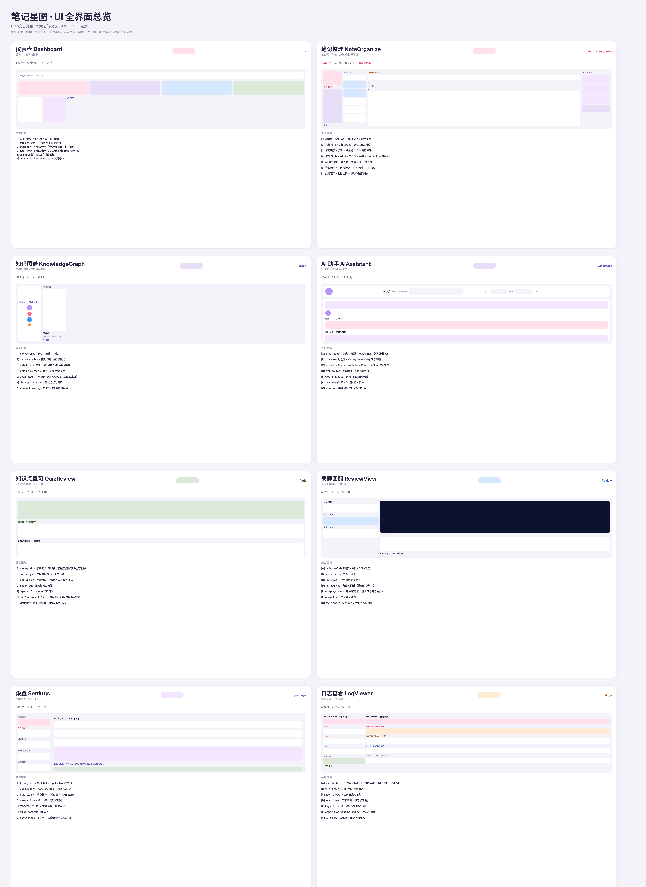
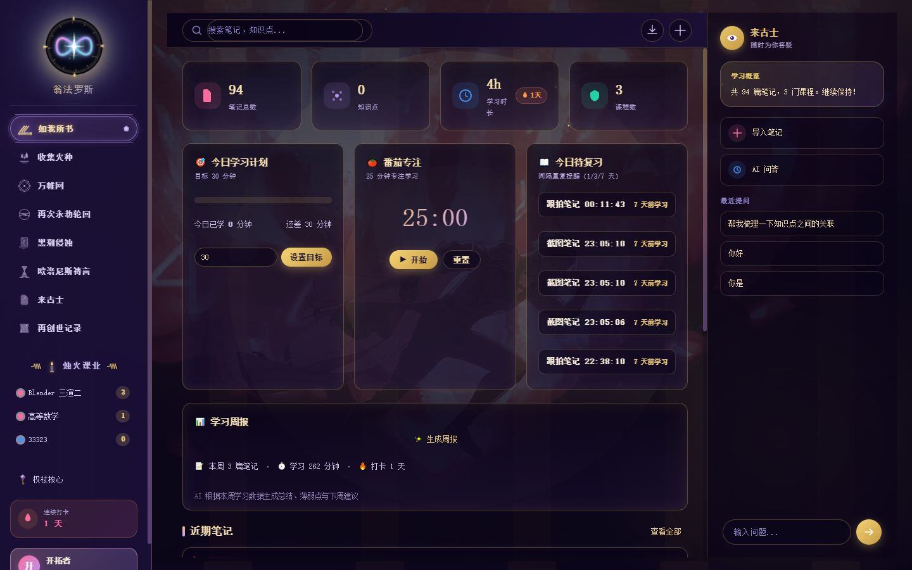
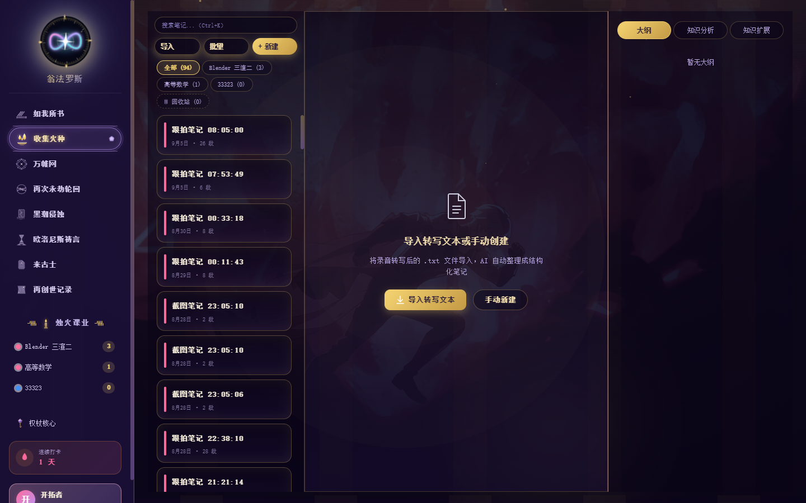
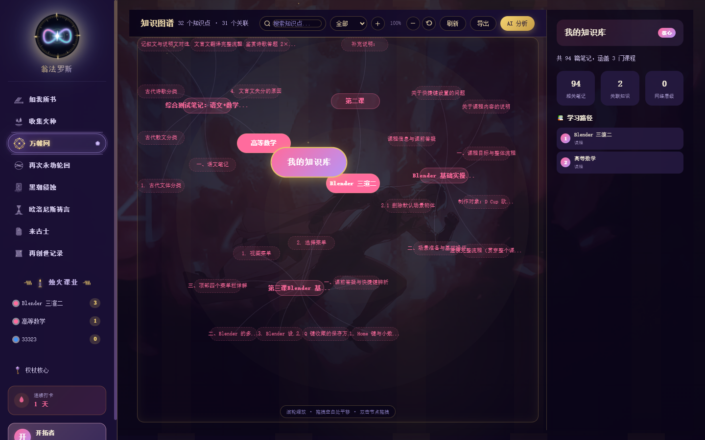
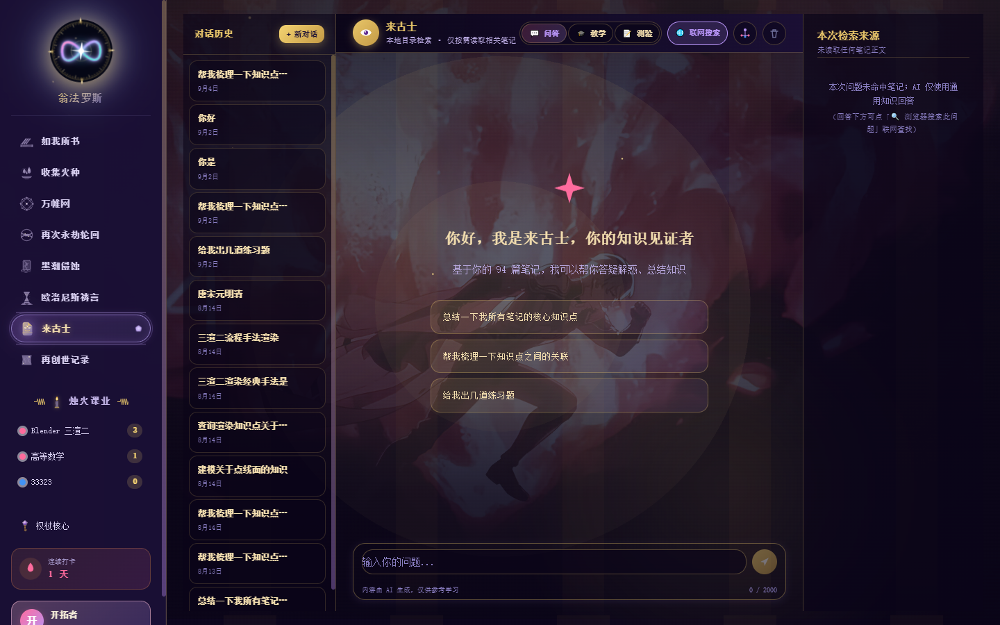
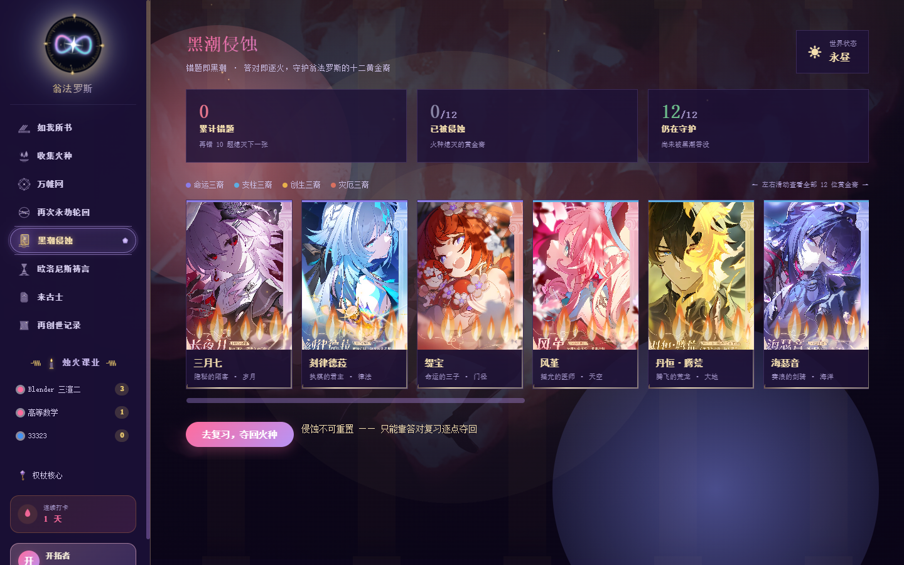
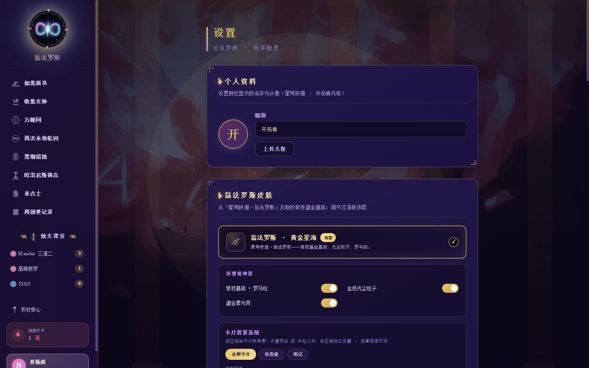

<div align="center">

# 🌌 笔记星图 · NoteStar

### 二次元网课笔记工具 — 录屏即跟拍，AI 帮你记

**一款本地优先、幻想系二次元美学的网课笔记与复习桌面工具**

</div>

<div align="center">

[](LICENSE)
[](#环境要求)
[](#环境要求)
[](#技术栈)
[](#技术栈)
[](#技术栈)

</div>

<div align="center">



</div>

> **🌐 Language / 语言： [中文](README.md) · [English](README.en.md)**

---

## ✨ 为什么选笔记星图

| | 核心亮点 |
|---|---|
| 🎥 | **录屏自动跟拍** — 悬浮球一键录屏，每 30 秒 AI 识别画面，自动生成带时间轴的图文笔记 |
| 🤖 | **AI 双模式** — 云端（DeepSeek / 火山引擎）+ 本地（Ollama）随时切换，数据自主可控 |
| 🔒 | **完全离线优先** — 笔记、截图、视频全部存本地硬盘，本地模式下数据不出本机 |
| 🎨 | **翁法罗斯二次元美学** — 粉紫金配色、Bento 卡片、内联 SVG 动效，全套代码绘制零图片依赖 |

---

## ⚡ 60 秒看懂怎么工作

1. **点悬浮球「录屏笔记」** → 系统请求屏幕录制授权
2. **正常上网课** → 后台每 30 秒自动截一帧画面
3. **AI 理解画面**（云端或本地模型）→ 用中文写出描述
4. **实时追加** 到跟拍笔记：`🎥 mm:ss` + 截图 + 描述
5. **停止录屏** → 视频落盘、会话绑定，笔记页按时间码回看所有重点
6. **AI 助教** 随时讲解、生成测验、关联知识图谱

---

## 📖 目录

- [截图展示](#-截图展示)
- [功能特性](#-功能特性)
- [技术栈](#-技术栈)
- [快速开始](#-快速开始)
- [本地 AI 模型](#-本地-ai-模型可选)
- [数据与隐私](#-数据与隐私)
- [目录结构](#-目录结构)
- [Roadmap](#-roadmap)
- [作者](#-作者)
- [License](#-license)

---

## 🖼️ 截图展示

<div align="center">

| 仪表盘 | 笔记整理 |
|:---:|:---:|
|  |  |
| 学习统计 · 番茄专注 · 复习清单 | 课程-笔记两级组织 · 跟拍列表 |

| 知识图谱 | AI 助教 |
|:---:|:---:|
|  |  |
| 万帷网 · 本地向量关联 | 上下文问答 · 讲解 |

| 黑潮侵蚀皮肤 | 设置 |
|:---:|:---:|
|  |  |
| 墨色侵蚀 · 金红圣火 · 余烬火星 | AI · 语音 · 外观 · 录屏 |

</div>

---

## 🚀 功能特性

### 🎨 视觉与美学
- 幻想系二次元 UI（翁法罗斯主题）：粉 `#FF6B9D` / 紫 `#B794F6` / 蓝 `#4292F5` + 金色点缀
- Bento 卡片布局、圆角胶囊按钮、柔和光晕
- 内联 SVG 动态 Logo 与导航图标，**全套代码绘制，无图片依赖**
- 「黑潮侵蚀」皮肤页（`/heirs`）：CSS/SVG 实时实现墨色吞噬、黑火窜高、金红圣火、余烬火星

### 🎥 跟拍笔记（悬浮球录屏）
- 系统级桌面悬浮球，一键「录屏笔记」
- 每 30s 自动截帧 → AI 识别 → 自动追加 `🎥 mm:ss` 图文条目
- 停止后自动归档：视频分段、时长统计、笔记绑定，支持时间轴回看
- 低性能设备优化：默认低分辨率低帧率采集

### 🤖 AI 双模式（云端 & 本地）
- **云端**：DeepSeek / 火山引擎 API，对话、摘要、测验等由云端大模型提供
- **本地**：Ollama（moondream 视觉 / qwen2.5 文本 / nomic 语义向量），全部跑在本机
- 两种模式随时切换，请求数据自主可控

### 📝 笔记整理与结构化
- 课程 - 笔记两级组织，Markdown 编写（KaTeX 公式渲染）
- AI 增强：摘要、扩写、思维导图、自动标题
- 导出 HTML 便于分享存档

### 🕸️ 知识网络
- 课程 / 笔记 / 知识点图谱化展示（万帷网）
- 基于本地向量的语义检索，跨课程找相关内容

### 🔁 复习闭环
- AI 测验生成、沉浸式复习模式、到期复习提醒（每小时检查）
- AI 助教对话，针对当前笔记上下文提问与讲解

### 🎙️ 语音闭环
- 跟拍 / 课程音频本地转写（faster-whisper + ffmpeg）
- Windows SAPI 语音朗读，听记复习

### 📊 统计与周报
- 仪表盘：学习时长、笔记量、复习进度、学习周报

---

## 🛠️ 技术栈

| 层 | 选型 |
|---|---|
| 渲染层 | Vue 3 + TypeScript + Vite |
| 桌面壳 | Electron（主进程直载源码，改完即生效） |
| 笔记渲染 | Markdown（marked）+ KaTeX |
| 云端 AI | DeepSeek API / 火山引擎（需自行配置 Key） |
| 本地 AI | Ollama：moondream / qwen2.5 / nomic-embed-text |
| 语音转写 | Python + faster-whisper（内置运行时） |
| 语音合成 | Windows SAPI |
| 存储 | 本地 JSON + 图片/视频文件 |

---

## ⚙️ 环境要求

- **Windows 10/11 64 位**（悬浮球、录屏、语音依赖 Windows 能力）
- **Node.js ≥ 18**（开发与构建）
- **（可选）Ollama** — 不装则用云端模式，其余功能正常
- **（可选）Python + faster-whisper + ffmpeg** — 音频转写，便携版已内置

---

## 🚀 快速开始

```bash
# 1) 安装依赖
cd app
npm install

# 2) 生产模式运行
npm run build
npm start

# 3) 开发模式（热更新）
npm run electron:dev        # Vite + Electron 主进程
```

**首次使用**：
1. 进「设置」配置 AI 平台（云端 API Key 或本地 Ollama）
2. 点悬浮球「录屏笔记」开始第一段跟拍
3. 录完到「笔记整理」查看自动生成的跟拍笔记

---

## 🧠 本地 AI 模型（可选）

```bash
ollama pull moondream            # 视觉识别：跟拍画面理解
ollama pull qwen2.5:7b-instruct  # 文本：翻译 / 问答 / 摘要 / 测验 / 周报
ollama pull nomic-embed-text     # 语义向量：跨课程检索与知识图谱
```

在「设置 → AI 配置」中切换云端 / 本地模式。模型未就绪时，跟拍条目自动降级为「已保存截图」，不阻塞录屏。

---

## 🔒 数据与隐私

- 所有笔记、截图、录屏均为**本地文件**（默认 `app/data`），JSON 文本存储
- AI 双模式：云端用 DeepSeek / 火山引擎 API（自行配置 Key）；本地用 Ollama，**数据不出本机**
- 彻底清理：退出应用后删除 `app/data` 目录即可（注意先备份）

---

## 📂 目录结构

```
.
├─ app/                      # Electron 应用主体
│  ├─ electron/              #   主进程 main.cjs、IPC、悬浮球、跟拍编排、AI 调用
│  ├─ src/                   #   Vue 3 渲染层（views / components / store / utils）
│  ├─ public/heirs/          #   黄金裔立绘资源
│  └─ package.json
├─ build/                    # 构建资源（图标、便携版启动器等）
├─ docs/                     # 架构与技术文档
└─ 启动*.bat                 # Windows 一键启动脚本
```

> `data / logs / vendor / Ollama` 等运行时目录已在 `.gitignore` 中排除。

---

## 🗺️ Roadmap

- 更多主题皮肤与更细的设计令牌体系
- macOS / Linux 适配（录屏与语音为 Windows 特性，需按平台替换）
- 笔记模板与分享卡片生成
- 云端同步（可选、默认关闭，保持本地优先）

---

## 👤 作者

本项目由 B 站 UP 主 **星萌Y小郭酱**（uid 12644772）开发维护。

- 📺 **哔哩哔哩**：[星萌Y小郭酱](https://space.bilibili.com/12644772) — 二次元 / Blender 三渲二 / 独立开发内容
- ✍️ 作品定位：把「学习工具」做成「二次元美学 × 本地优先」的可玩之物

欢迎 Star、提 Issue 或到 B 站一键三连交流 🌟

---

## 📄 License

本项目基于 **[MIT License](LICENSE)** 开源。

> 引用或二次开发请标明本仓库出处（附仓库链接及作者署名）。本仓库持续迭代更新，引用时请留意同步上游最新版本。第三方依赖遵循各自许可证。
