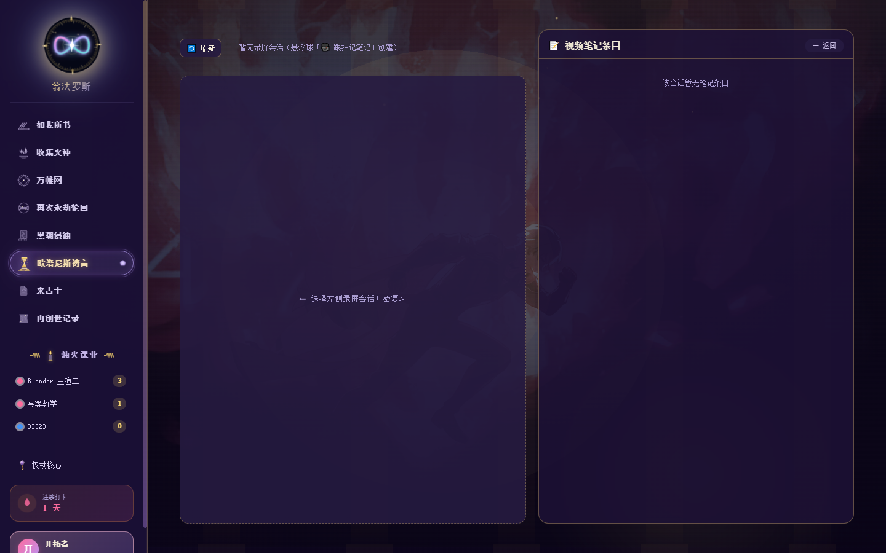
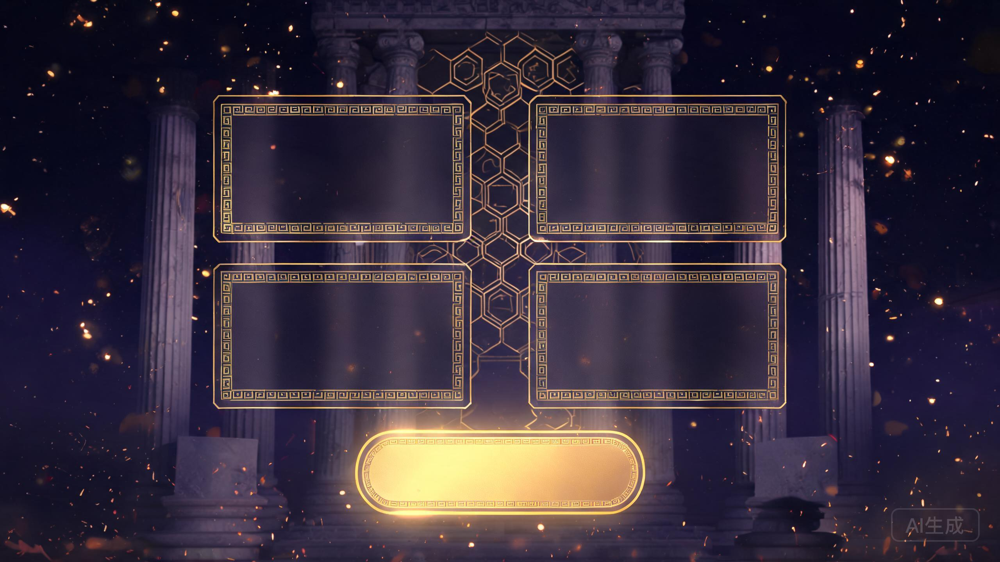

<!-- ============================================================
     笔记星图 · NoteStar  README
     二次元 / 翁法罗斯美学 / 本地优先
     ============================================================ -->

<p align="center">
  <a href="https://space.bilibili.com/12644772">
    
  </a>
</p>

<div align="center">

**🤍 星萌Y小郭酱**

B 站 UP 主 · 二次元 / Blender 三渲二 / 独立开发

📺 [哔哩哔哩空间](https://space.bilibili.com/12644772) · 🌐 [中文](README.md) / [English](README.en.md)

</div>

---

<p align="center">


</p>

<div align="center">

# 🌌 笔记星图 · NoteStar

### 把网课，变成一场翁法罗斯的冒险 ✨

**录屏自动跟拍成笔记 · AI 助教 · 本地优先 · 二次元美学**

</div>

<div align="center">

[](#-license)
[](#-环境要求)
[](#-环境要求)
[](#-技术栈)
[](#-技术栈)
[](https://space.bilibili.com/12644772)

</div>

---

## 🎭 这就是笔记星图

上网课手忙脚乱记笔记？笔记翻完就忘？复习像开荒没地图？

**记不住的，笔记星图帮你记。**

一键点悬浮球开录，AI 在后台时不时截一帧、看懂你在学什么，把重点带着时间码整理成图文笔记。下课直接复习——不用再对着录屏从头拖进度条 (｡•̀ᴗ-)✧

> 数据都在你自己电脑上，本地模式下连网都不用连。

---

## ✨ 魔力在哪

<div align="center">

| | |
|:---:|:---:|
| **🎥 跟拍笔记**<br>悬浮球一键录屏，AI 自动截帧识别，时间轴图文笔记实时生成 | **🤖 AI 双模式**<br>云端 DeepSeek / 火山，本地 Ollama，随时切换 |
| **🕸️ 万帷网**<br>知识点自动连成网，跨课程一键串起 | **🔁 复习闭环**<br>AI 出题、沉浸复习、到期提醒 |
| **🎙️ 语音闭环**<br>本地转写 + 语音朗读，走路也能复习 | **📊 学习仪表盘**<br>时长 · 笔记 · 进度 · 周报，看得见 |
| **🎨 翁法罗斯美学**<br>粉紫金配色 · Bento 卡片 · 会呼吸的 SVG | **🔒 数据自主**<br>全存本地，本地模式绝不出机 |

</div>

---

## 🎬 视频介绍

<div align="center">

<details open>
<summary><strong>▶ 点击播放 B 站介绍视频</strong> · BV1eWY76xEG5</summary>

<br>

<iframe
  src="https://player.bilibili.com/player.html?isOutside=true&aid=117252120649017&bvid=BV1eWY76xEG5&cid=41789885335&p=1&autoplay=0"
  scrolling="no"
  border="0"
  frameborder="no"
  framespacing="0"
  allowfullscreen="true"
  style="width:100%;max-width:720px;height:480px;border-radius:12px;display:block;margin:0 auto;"
></iframe>

<p align="center"><a href="https://www.bilibili.com/video/BV1eWY76xEG5" target="_blank">📺 去 B 站原页面观看</a></p>

</details>

</div>

---

## 🖼️ 长这样

<div align="center">

| 仪表盘 · 学习统计 | 笔记整理 · 时间轴 |
|:---:|:---:|
|  |  |
| 学习统计 · 番茄专注 · 复习清单 | 课程-笔记两层 · 跟拍列表 |

| 万帷网 · 知识图谱 | AI 助教 · 上下文问答 |
|:---:|:---:|
|  |  |
| 知识点自动关联 | 基于你的笔记讲解、出题 |

| 沉浸式复习 | 黑潮侵蚀 · 皮肤 |
|:---:|:---:|
|  |  |
| 复习就记住 | 墨色吞噬 · 金红圣火 · 余烬火星 |

| 设置 | |
|:---:|:---:|
|  |  |
| AI · 语音 · 外观 · 录屏 | 皮肤才是本体 🎨 |

</div>

---

## 🚀 60 秒上手

```bash
cd app
npm install        # 安装依赖
npm run build      # 生产构建
npm start          # 跑起来!
```

> Windows 用户偷懒版：双击根目录 `启动.bat` 一键启动。

**首次使用**：进「设置」配好 AI（云端填 Key / 本地装 Ollama），然后点悬浮球开录——剩下的交给它 (๑•̀ㅂ•́)و✧

---

## 🧠 本地 AI（可选项）

想让数据完全不出本机？自己拉仨模型就行：

```bash
ollama pull moondream            # 视觉：看懂你屏幕上的画面
ollama pull qwen2.5:7b-instruct  # 文本：聊天 / 摘要 / 出题 / 周报
ollama pull nomic-embed-text     # 向量：把知识点织进万帷网
```

没模型也不慌——跟拍自动降级成「截图存档」，录屏照录不误，之后有模型再识别也行。

---

## 🛠️ 技术栈

| 层 | 选型 |
|---|---|
| 渲染层 | Vue 3 · TypeScript · Vite |
| 桌面壳 | Electron（主进程直载源码） |
| 笔记渲染 | Markdown · KaTeX 公式 |
| 云端 AI | DeepSeek / 火山引擎 |
| 本地 AI | Ollama：moondream / qwen2.5 / nomic |
| 语音转写 / 合成 | faster-whisper · Windows SAPI |
| 存储 | 本地 JSON + 图片/视频文件 |

---

## ⚙️ 环境要求

- **Windows 10/11 64 位**（悬浮球、录屏、语音依赖 Windows）
- **Node.js ≥ 18**
- **（可选）Ollama** — 不装就用云端模式
- **（可选）Python + ffmpeg** — 音频转写，便携版已内置

---

## 🗺️ Roadmap

- 🎨 更多主题皮肤（皮肤才是本体！）
- 🍎 macOS / Linux 适配
- 📝 笔记模板 & 分享卡片
- ☁️ 云端同步（可选项，默认关闭，保持本地优先）

---

## 💭 为什么做这个？

做笔记星图，是因为我相信：**AI 是辅助学习的工具，但不能代替你学习。**

AI 迭代很快，会的越来越多。但 **AI 会的，不代表你会。**

所以这个软件从不是「让 AI 帮你把课学了」，而是把记录、整理、复习这些琐碎又耗时的环节自动化，让你把省下的时间，真正用在**理解和思考**上。

跟拍帮你不漏重点，图谱帮你串知识，出题帮你验掌握——但最终坐在屏幕前、把知识变成自己的，还是你自己。

愿这套小小的工具，能陪你走得更远一点 ✨

---

## 👤 作者

<div align="center">

[](https://space.bilibili.com/12644772)

**星萌Y小郭酱**

B 站 UP 主 · 二次元 / Blender 三渲二 / 独立开发

📺 [进我的哔哩哔哩空间](https://space.bilibili.com/12644772)

喜欢的话，点个 **Star ⭐** 或者来 B 站找我玩呀~

</div>

---

## 📄 License

本项目基于 **[MIT License](LICENSE)** 开源。二次开发请注明出处，第三方依赖遵循各自许可证。